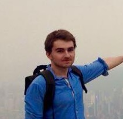

# Perceval Wajsbürt

Hi! I’m Perceval Wajsbürt, currently working as an ML/NLP engineer at [AP-HP (Paris Hospitals)](https://wikipedia.org/wiki/Assistance_publique_-_H%C3%B4pitaux_de_Paris) since 2022. I hold a PhD in medical NLP from Sorbonne Université, completed under the direction of (the amazing) [Xavier Tannier](http://xavier.tannier.free.fr), and an engineering degree from CentraleSupélec.

Since 2024, I’ve also been serving as the AI advisor for AP-HP’s Digital Services Department (Direction des Services Numériques, DSN), providing scientific and technical guidance on AI-related topics across the organization.

My work focuses on medical text mining, structured prediction models, and developing practical AI-driven tools, such as pseudonymization solutions and large-scale information extraction pipelines, to support healthcare research and enhance patient care. I’m also passionate about open-source software and designing UI/UX that’s friendly to both users and developers.

=== card
    **Current position:** NLP engineer at AP-HP   
    **Contact:** perceval.wajsburt[at]aphp[dot]fr   
    **LinkedIn:** [linkedin.com/in/percevalw](https://www.linkedin.com/in/percevalw)   
    **GitHub:** [github.com/percevalw](https://github.com/percevalw)   
